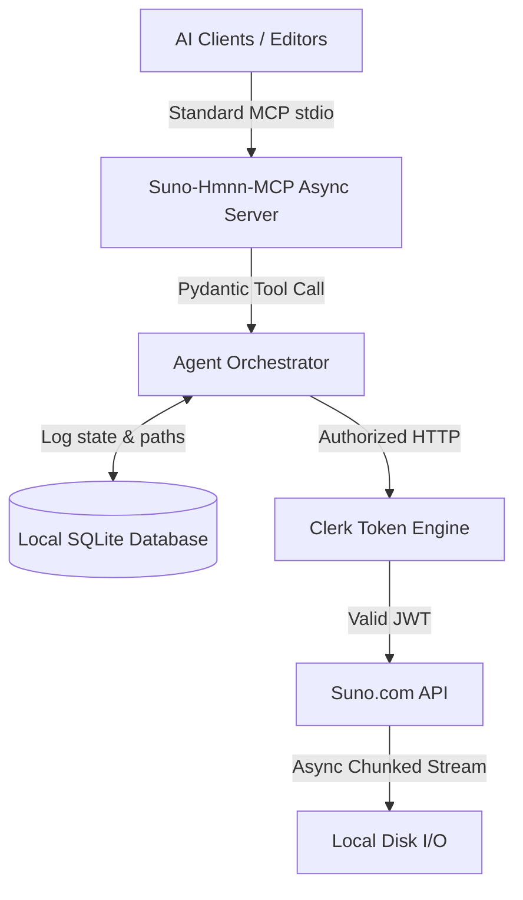

# Suno-Hmnn-MCP 🎵

<div align="center">

[](https://opensource.org/licenses/MIT)
[](https://www.python.org/)
[](https://modelcontextprotocol.io/)
[](https://gofastmcp.com)
[](http://makeapullrequest.com)

**The ultimate production-grade Suno AI MCP server (v5.5 Pro/v5/v4) for Hermes Agent, Antigravity IDE, Cursor, Claude Desktop, and VS Code.**

</div>

> **Suno-Hmnn-MCP** is an enterprise-grade, local, self-healing Model Context Protocol (MCP) framework that bridges **Suno AI (v5.5 Pro/v5/v4)** directly into your favorite AI Agents and local REST API services. 

---

## ✨ Enterprise-Grade Refactor (v2.0)

We have completely rebuilt the core architecture to provide industry-leading stability and performance.

### 🚀 What's New?
*   **Fully Asynchronous Event Loop**: Migrated from blocking synchronous `httpx` to `httpx.AsyncClient` with `async/await`. The server can now handle dozens of concurrent audio generations and heavy downloads without freezing the host IDE.
*   **Built-in Agent Orchestrator**: Replaced raw polling. The `suno_generate` and `suno_extend` tools now include a `wait_for_audio` parameter. The server handles status polling internally, only returning to the AI agent when the final audio tracks are ready to download.
*   **Memory-Safe Audio Chunking**: Implemented `aiofiles` chunked streaming for binary audio downloads. Safely download uncompressed 150MB WAV stems with near-zero RAM footprint.
*   **Persistent SQLite State Tracking**: Activated the `StudioDatabase`. Every track, prompt, and file path is automatically logged to a local SQLite database. Agents can use the new `suno_list_local_library` tool to recall past sessions seamlessly.
*   **Cross-Platform Paths**: Removed hardcoded directories. Downloads and databases are now automatically routed to standard OS directories (e.g., `~/Music/SunoStudio` or `%USERPROFILE%\Music\SunoStudio`) using `platformdirs`.
*   **Pydantic Strict Typing**: Tool inputs are now protected by `pydantic.Field` validations. Prompts are capped at 3000 chars, tags at 120 chars, and model selections are strictly enforced via Enums (`ModelVersion.CHIRP_V4`), preventing 400 Bad Request errors.

---

## ⚡ Why Suno-Hmnn-MCP? (Comparison Matrix)

| Feature | Standard Open-Source Script | Paid API Wrappers (e.g. AceData) | **Suno-Hmnn-MCP (v2.0)** |
| :--- | :---: | :---: | :---: |
| **Concurrency** | Single-threaded (Blocking) | Cloud Scaled | **Full Async (Non-Blocking)** |
| **Authentication** | Manual DevTools Cookie Paste | Paid API Key | **Automated Playwright Portal** |
| **Token Expiry Handling**| Crashes on 401 | N/A | **Self-Healing Clerk JWT Refresh** |
| **Audio I/O** | Loads full file into RAM | Standard HTTP | **Chunked Disk Streaming (Safe)** |
| **Stem Isolation** | ❌ No | Extra Fee | **Native Premier Vocal/Backing Stems** |
| **Precision Extension**| ❌ No | Limited | **Millisecond Timestamp Extensions** |
| **State Tracking** | Memory Only (Lost on restart) | Cloud Database | **Local SQLite Engine (`studio_os.db`)** |
| **Input Validation** | None (Blind API passthrough)| Basic | **Strict Pydantic Enums & Caps** |

---

## 🏗️ Architecture Overview



---

## 🧰 Exhaustive Function & Tool Reference

`Suno-Hmnn-MCP` exposes 10 production-grade tools directly to your AI Agents:

### 1. `suno_generate`
Generates original music tracks using custom lyrics or prompt descriptions. Wait mode built-in.
* **Parameters:** `prompt` (Max 3000c), `tags` (Max 120c), `title`, `make_instrumental`, `model_version` (`chirp-v5-5-pro`, `chirp-v5`, `chirp-v4`), `custom_lyrics`, `wait_for_audio`.

### 2. `suno_extend`
Extends an existing track starting from an exact timestamp.

### 3. `suno_generate_from_midi` (NEW - Studio 2.0)
Uploads a base64 encoded MIDI file to Suno Studio 2.0 and generates a full audio track based on those chords and melodies.

### 4. `suno_generate_from_audio` (NEW)
Uses a previously uploaded Audio Prompt ID as the base for a new track generation or style transfer.

### 5. `suno_separate_stems`
Triggers Premier stem isolation on an existing clip.

### 6. `suno_get_clip`
Retrieves live clip metadata, generation status, lyrics alignment, and audio download links.

### 7. `suno_download_file`
Downloads uncompressed WAV, MP3, or stem files safely to local storage using memory-safe async chunking.

### 8. `suno_list_local_library`
Allows the agent to read the local SQLite database and recall tracks generated in past sessions.

### 9. `suno_get_credits`
Returns account information, plan type, and remaining credit allowance (including new WMG download limit tracking).

### 10. `suno_auth_status`
Diagnostic tool that reports the health of the Clerk Token Rotation Engine.

---

## 🛠️ Step-by-Step Installation Tutorial

### Prerequisites
1. **Python 3.10 or higher** installed.
2. **Google Chrome** or **Microsoft Edge** browser installed.
3. An active **Suno AI** account.

### 1. Clone & Set Up Directory
```bash
git clone https://github.com/SialkiLabs/Suno-Hmnn-MCP.git
cd Suno-Hmnn-MCP
```

### 2. Install Dependencies
```bash
pip install -r requirements.txt
playwright install chromium
```

### 3. Run the Automated Auth Portal
Launch the frictionless login wizard:
```bash
python wizard.py
```

* **What happens:**
  1. The setup wizard boots Google Chrome natively.
  2. Log into your Suno account on the Chrome window.
  3. As soon as you log in, the wizard captures your secure cookie bundle and writes your `.env` configuration file automatically.

---

## 🔌 Client Integration Guide

### Hermes Agent
Add to `~/.hermes/config.yaml` or workspace `mcp.json`:
```yaml
mcp_servers:
  suno_premier:
    command: "python"
    args: ["/absolute/path/to/Suno-Hmnn-MCP/server.py"]
```

### Antigravity IDE & Cursor
Add to `.cursor/mcp.json`:
```json
{
  "mcpServers": {
    "suno-hmnn": {
      "command": "python",
      "args": ["/absolute/path/to/Suno-Hmnn-MCP/server.py"]
    }
  }
}
```

### Claude Desktop
Add to `%APPDATA%\Claude\claude_desktop_config.json` (Windows) or `~/Library/Application Support/Claude/claude_desktop_config.json` (Mac):
```json
{
  "mcpServers": {
    "suno-hmnn": {
      "command": "python",
      "args": ["/absolute/path/to/Suno-Hmnn-MCP/server.py"]
    }
  }
}
```

---

## 🛡️ Security & Code Auditability Guarantee

`Suno-Hmnn-MCP` is engineered with an uncompromising commitment to privacy and open-source transparency:
* **100% Local Air-Gap**: Zero data, tokens, or cookies are ever transmitted to any third-party telemetry, analytics, or external server.
* **Direct Official Endpoints**: All network communications occur exclusively between your local PC (`127.0.0.1`) and Suno's official domains.
* **Memory Safety**: Uses strict chunked disk I/O and Pydantic validation to protect your host machine from memory spikes or bad payloads.
* **Auditable Codebase**: Every single line of network and state management code is open-source and highly readable.

---

## ❓ Comprehensive FAQ & Security Deep-Dive

#### Q: Will this get my Suno account flagged or banned?
**No.** `Suno-Hmnn-MCP` runs locally on your PC. It uses native Chrome/Edge headers, human-paced polling intervals, and authentic Clerk Bearer JWT tokens. It is indistinguishable from standard web browser traffic.

#### Q: Where are generated files and databases stored?
By default, all audio files and the `studio_os.db` SQLite database are saved to your OS-native Music directory (`~/Music/SunoStudio` or `%USERPROFILE%\Music\SunoStudio`). You can customize this by setting `SUNO_OUTPUT_DIR` in `.env`.

---

## 📄 License & Authorship

Licensed under the **MIT License** — free for personal, educational, and commercial use.

**Lead Architect & Author:** **George AK Neihsial**  
*An open-source welfare initiative created by Sialki Labs to provide developers, creators, prompt engineers, and AI research communities with a robust, zero-cost bridge between generative audio platforms and local autonomous AI agents.*

---

## 🔍 Search Engine Index & Long-Tail Query Mapping

*This section optimizes discovery for search engine crawlers (Google, Bing, Perplexity, ChatGPT, Claude) and GitHub's internal code search.*

* **Primary Keywords**: Suno AI MCP, Suno MCP Server, Suno API Python, Suno v4 MCP, Suno Premier API, Suno Stem Separation API, Suno WAV Exporter, Suno Claude MCP, Suno Cursor MCP, Suno Hermes Agent.
* **Supported Integrations**: Hermes Agent App, Antigravity IDE, Cursor IDE, Windsurf, Claude Desktop, VS Code, Roo Code, Cline, LibreChat.
* **Supported Features**: Suno chirp-v5-5-pro, Suno chirp-v5, Suno chirp-v4, Custom Lyrics Generator, Studio 2.0 MIDI Prompts, Audio Prompts, Timestamp Audio Extensions, Stem Isolator (Vocals/Instrumental), Uncompressed 24-bit WAV Downloader, Clerk Token Rotation Engine, Asyncio MCP.
